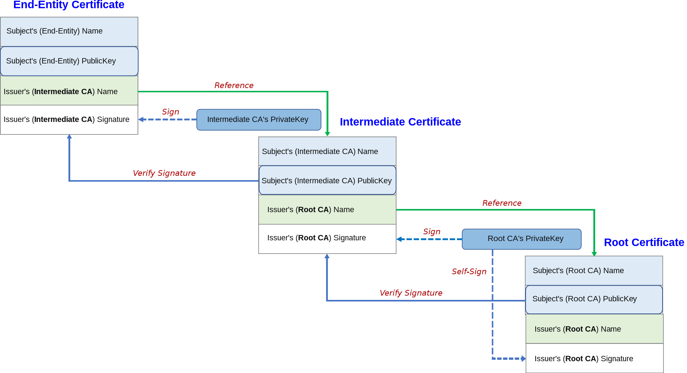

# Certificate Chain

## Key Terms
* **CA** (Certificate Authority) is a trusted third-party organization that issues digital certificates to entities such as websites, servers and clients.
* **Issuer**  is the entity that actually issues the certificate, which can be either a CA or the entity (for examppe, a company) itself.
* **Subject** is a field within the digital certificate that identifies the entity that the certificate is issued to.

  The subject field typically includes information such as the domain name or IP address of the entity, along with other identifying information such as the organization name, location, and contact information. The subject field is used by the client to verify the identity of the server or other entity it is communicating with over the TLS connection.
  
## How it works
Every browser or operating system is delivered with a set of `root cerstificate authorities` (CA) which are trusted out of the box.
  
## Chain of trust

  

#### Root Certificate
* Self-signed and self-issued (Subject = Issuer)
* Usually has long expirity date
* Trusted by web-browsers, applications and etc

#### Intermediate Certificate

## Resourcses
* [Certificates explained](https://youtu.be/kAaIYRJoJkc)
* https://www.youtube.com/watch?v=Z81jegMCrfk
