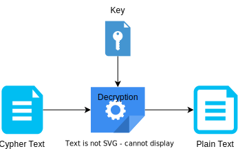
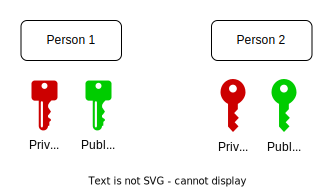
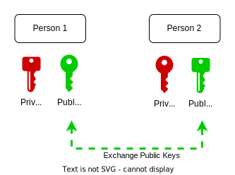

# Symmetric and Asymmetric Encryption

## Encryption Basics
Encryption is a security control used to provide confidentiality protection for data. It is a mathematical transformation of data requiring protection (plaintext) into a form not easily understood by unauthorized people or machines (ciphertext).

Each encryption and decryption function requires a cryptographic key. A cryptographic key is a string of binary digits used as an input to encryption and decryption functions.

### Encryption
The encryption function requires two inputs, plaintext and a cryptographic key, in order to output ciphertext

  

### Decryption
The decryption function requires two inputs, ciphertext and a cryptographic key, in order to output plaintext.

  

## Symmetric Encryption
`Symmetric encryption` uses a unique key that must be shared between parties (people or software) who need to receive messages. Common Symmetric encryption algorithms:
  * AES - one of the most frequently used algorithms. It is fast, ideal when handling large amounts of encrypted data.
  * TwoFish (previously BlowFish) - gives flexibility in performance, total control of the encryption speed.
  * 3DEC - despite its slower speeds and generally outdated status when compared to AES, it is still widely utilized in financial services to encrypt ATM PINs and UNIX passwords.

  

## Asymmetric Encryption
`Asymmetric encryption` uses a pair of public keys and a private key to encrypt and decrypt messages when they are communicated. Common algorithms:
  * RSA (Rivest–Shamir–Adleman) - mostly used in digital signatures, email encryption, SSL/TLS certificates and browsers. Low speed, it is NOT convinient for processing large amount of data.
  * ECC (Elliptic Curve Cryptography) - low-cost, low-impact, high-security. It is an ideal standard for protecting sensitive mobiles and apps. It may likely be the algorithm of the future.

### How it works
1. Both Paerson1 and Person2 generate their own pairs public/private keys.
  An algorithm generates a public and private key that are mathematically linked to each other.

  

2. **Person1** and **Person2** exchange their public keys. Private keys are never exchainged.

 

  

* **Person1** uses `Public Key2` to encrypt data. Encrypted data (cypher text) is sent to Person2. **Person2** uses its `Private key2` to decrypt data.

  

* **Person2** uses Public Key1 to encrypt data. Encrypted data (cypher text) is sent to **Person1**. **Person1** uses its `Private key1` to decrypt data.

  

## Resurces
* https://library.ahima.org/doc?oid=104090#.ZBV-TOzMJUd
* [Data Encryption](https://preyproject.com/blog/types-of-encryption-symmetric-or-asymmetric-rsa-or-aes#:~:text=Symmetric%20vs%20Asymmetric%20Encryption,-Encryption%20types%20can&text=Symmetric%20encryption%20uses%20a%20unique,messages%20when%20they%20are%20communicated)
* [Asymmetric Encryption - Simply explained](https://www.youtube.com/watch?v=AQDCe585Lnc)
