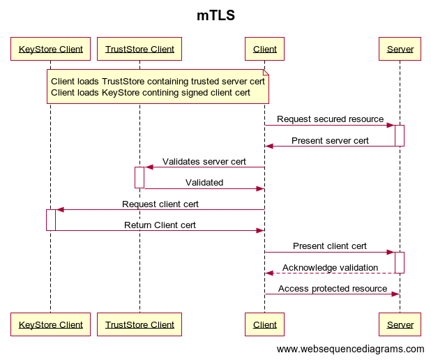

# Keystore VS Truststore

Keystore and Truststore are very similar in terms of structure. The only difference is what they store, what is purpose and to use them.

## Definistion
A keystore is a repository that contains private keys and their corresponding digital certificates. A keystore can also contain public keys of other parties, which are used to encrypt data sent to them.

A truststore is a repository that contains trusted digital certificates used to verify the identity of remote parties. When a client connects to a server, it needs to verify that the server's digital certificate is issued by a trusted authority and that it has not been tampered with. The truststore contains the public keys of the trusted authorities that are used to verify the server's digital certificate.

In summary, the main difference between a keystore and a truststore is that a keystore is used to store private keys and their corresponding digital certificates, while a truststore is used to store trusted public keys of other parties. The keystore is used by the server to prove its identity to the client, while the truststore is used by the client to verify the identity of the server.

## Purpose
* KeyStores provide credentials, TrustStores verify credentials;
* Keystore is used by [KeyManager](https://docs.oracle.com/en/java/javase/11/docs/api/java.base/javax/net/ssl/KeyManager.html), truststore is used by [TrustManager](https://docs.oracle.com/en/java/javase/11/docs/api/java.base/javax/net/ssl/TrustManager.html);
* Keystore is used to authenticate the identity of a server to a client during an SSL/TLS handshake. After that a secure connection can be established.

## Content
* Keystore consists of private key which is configured at server side for SSL connection.  
* Keystore can be also configured on client side if client authentication is required at a server side. Client uses its private key (stored in keystore) to sign a piece of data that is sent to the server as a part of handshake. 
* Truststore consits of public keys and certificates. It is configured on the side where autjentication of other party is required.

## Formats for Certificates
* Privacy-Enhanced Mail (**PEM**) is Distinguished Encoding Rules (DER) that has been Base64 encoded. Used for keys and certificates.
* **PKCS12** is a password-protected format that can contain multiple certificates and keys.
* Java KeyStore (**JKS**) is Java version of PKCS12 and also password protected. Entries in a JKS file must have an “alias” that is unique. If an alias is not specified, “mykey” is used by default. It’s like a database for certs and keys.

## Java truststore
Java distribution includes a file `$JAVA_HOME/lib/security/cacerts`, it is a collection of trusted certificate authority (CA) certificates. This is default trustore for JVM. A list of certificates, included into `cacerts`, may be different for different JVMs, it depends on a vendor.

## Passwords
Both keystore and truststore are secured with a password. A password is used to protect the integrity of a keystore. if you don't provide any store password, you can still read the contents of a store. The command keytool -list demonstrates this behavior (use it with an empty password).

## Empty KeyStore
[KeyStore](https://docs.oracle.com/en/java/javase/11/docs/api/java.base/java/security/KeyStore.html) class is used to initialise [KeyManagerFactory](https://docs.oracle.com/en/java/javase/11/docs/api/java.base/javax/net/ssl/KeyManagerFactory.html) and [TrustManagerFactory](https://docs.oracle.com/en/java/javase/11/docs/api/java.base/javax/net/ssl/TrustManagerFactory.html). and create keyStore or trustStore. Empty keyStore or trustStore are possible (see javadoc [KeyStore](https://docs.oracle.com/en/java/javase/11/docs/api/java.base/java/security/KeyStore.html))

## Methods
### Server authentication
According to [TLS1.3](https://www.rfc-editor.org/rfc/rfc8446#appendix-C.2) specification, a client should always validate a server cert. But this may depend on [implementation](https://en.wikipedia.org/wiki/Comparison_of_TLS_implementations) ([OpenSSL](https://www.openssl.org/), [GnuTLS](https://www.gnutls.org/), [JSSE](https://docs.oracle.com/javase/8/docs/technotes/guides/security/jsse/JSSERefGuide.html)).
* Server presents a digital certificate to the client, which contains information about the server's identity and is signed by a trusted CA. 
* The client can verify the server's identity by checking the certificate's signature and the CA that issued the certificate.

  

### Client authentication
* Client presents a digital certificate to the server, which contains information about the client's identity and is signed by a trusted CA. 
* The server can verify the client's identity by checking the certificate's signature and the CA that issued the certificate.

### Mutual TLS (mTLS)
* A server verifies client's identity using client's digital certificate, and the client also verifies the server's identity using the server's digital certificate.
* mTLS needs to be configured on a server side, a server needs to require client certificate authentication. Also the CA that issued the client certificates should be specified on a server side

  

# References
* [Keystore VS Truststore ](https://www.youtube.com/watch?v=Ur9LlNOYnRg)
* [Difference between trustStore vs keyStore in Java SSL](https://www.java67.com/2012/12/difference-between-truststore-vs.html)
* [What you need to know about SSL/TLS](https://robinhowlett.com/blog/2016/01/05/everything-you-ever-wanted-to-know-about-ssl-but-were-afraid-to-ask/)
* [import cert and install it in keystore](https://magicmonster.com/kb/prg/java/ssl/pkix_path_building_failed/)
