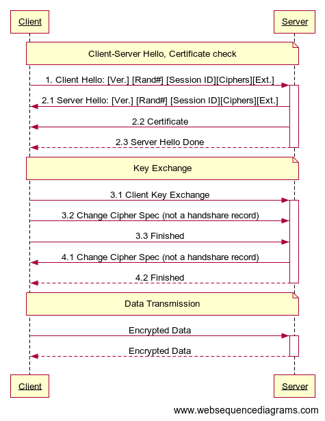
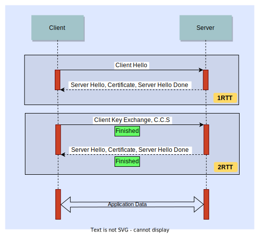
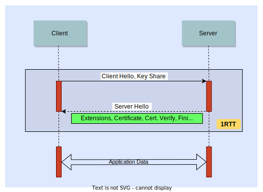

# TLS Handshake
### Summary
TLS Handshake creates a "protected tunnel" between Client and Server, it protects Bulk Data transfer with CIA (Confidentiality, Integrity, and Availability)

TLS 1.2 uses RSA for Key Exchage, in TLS 1.3 RSA has been removed. TLS 1.3 uses more advanced approach called [Diffie–Hellman key exchange](https://en.wikipedia.org/wiki/Diffie%E2%80%93Hellman_key_exchange). Handshake in TLS 1.3 is faster.

### TLS 1.2 Handshake

  

1. Client Hello
   Client sends the following data
   * **Ver.** - Highest TLS version that client supports
   * **Rand#** - Random number (32 bytes/256 bit). Timestamp encoded in first four bytes
   * **Session ID** - 8 byte value used to identify this specific session. Initial Client Hello Session-ID may include all 0's (00000...)
   * **Cipher Suites** - list of Cipher Suites that Client supports in an order which Client prefers
   * **Extensions** - optional additional features added to TLS/SSL
  
2. Server Hello
    * **Ver.**
    * Rand#
    * Session ID
    * Cipher Suites - list of Cipher Suites that Server supports
    * **Extensions** - optional additional features added to TLS/SSL

3. Key exchange, cipher spec. Finished
    * Message `3.3 Finished` is encrypted
4. Change cipher spec. Finished
    * Message `4.2 Finished` is encrypted
5. Data transmission
    * Send encrypted data
    * Get encrypted data

#### Round Trips
Communications [**Client-Server Hello, Certificate Check**] and [**Key Exchange**] on the diagram above are called *Round Trips*. So, TLS1.2 handshake requires two Round Trips to complete before data transmission will start. It is also called two round trips time (abbreviated as **2RTT**).

  

### TLS 1.3 Handshake
TLS 1.3 offers several improvements over earlier versions, most notably a faster TLS handshake.

  

#### TLS 1.3 key features
* RSA for Key Exchage has been removed, TLS 1.3 uses more advanced approach [Diffie–Hellman key exchange](https://en.wikipedia.org/wiki/Diffie%E2%80%93Hellman_key_exchange);
* TLS 1.3 handshake is shorter (2RTT -> 1RTT).
* There is also way to do 0RTT: clent sends encrypted application data with a Client Hello in the first message to TLS web server.
* Most of handshate messages are encrypted

### Resourcses
- [SSL, TLS, HTTPS Explained](https://youtu.be/j9QmMEWmcfo)
- [TLS Handshake](https://youtu.be/ZkL10eoG1PY)
- [TLS 1.3 Handshake](https://youtu.be/JA0vaIb4158)
- [Key differences Between TLS 1.2 and TLS 1.3](https://www.a10networks.com/glossary/key-differences-between-tls-1-2-and-tls-1-3/)

